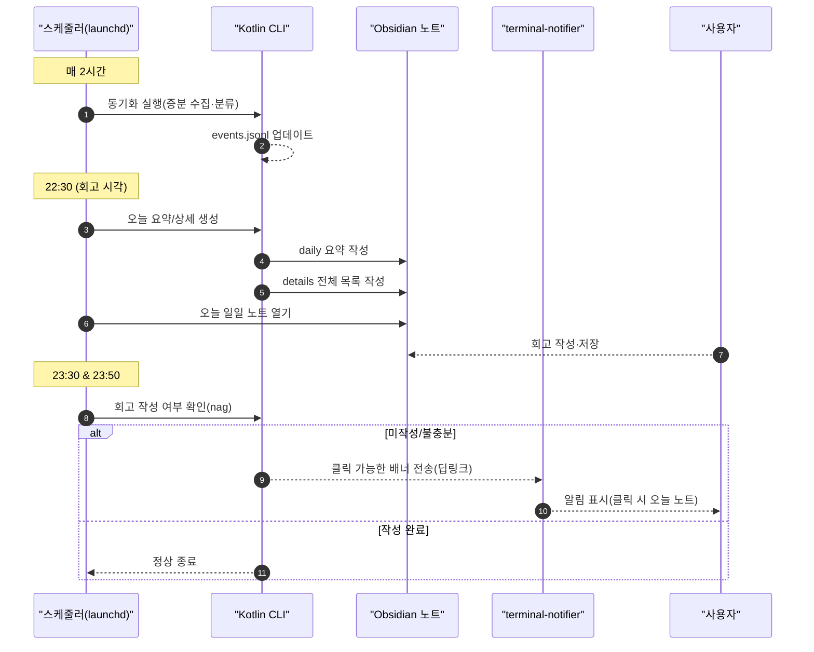
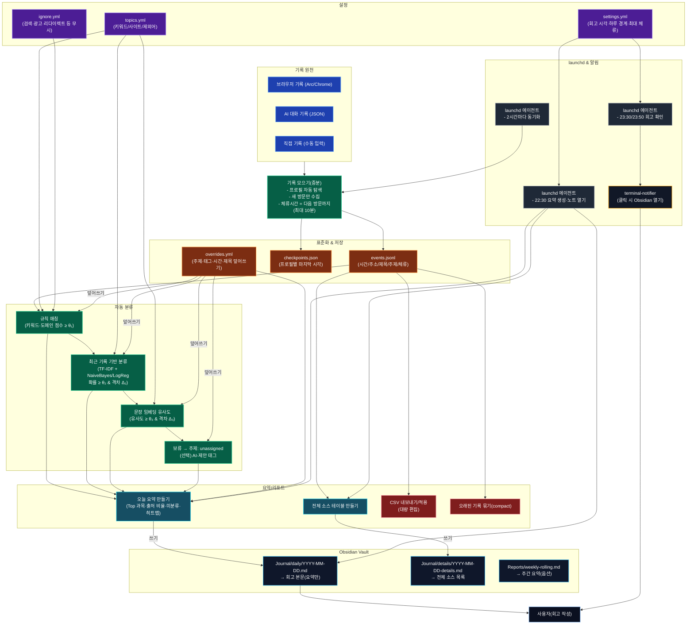

# Auto After Planner
사용자의 인터넷 및 LLM 기록 등을 기록하여 유의미한 통계기록을 보여줍니다.  
매일의 회고기록 작성 회초리는 덤입니다.

## 목적
지극히 개인적인 이유로 만들고자 합니다.  
1. 제 공부 습관을 보완합니다.
2. Kotlin 이라는 언어와 Amper 라는 빌드 툴에 적응합니다.
3. 최대한 단기완성을 목표로 합니다.

### 1. 공부습관 보완하기
평소의 제 공부방식은 무계획 그자체입니다.  
순간순간 하고 싶은, 생각나는 공부를 합니다.  
이는 다양하고 폭넓게 공부할 수 있다는 장점이있지만, 반대로 말하면 깊이가 부족합니다.  
또한 체계적이지 못하므로, 어느 공부가 부족한지 알 수 있는 방법이 없습니다.  

이에 따라, 데이터에 따른 통계를 바탕으로 보완하고자 합니다.  
단, 지금까지의 개인적인 경험에 따르면 스스로 작성해야하는 부분이 많다면, 금방 버려질 것임을 알고 있으므로,  
되도록 자동화하는 것이 목표입니다.  

이에 평소 공부 습관을 고려하여, 인터넷 및 LLM 기록을 데이터로 삼을 것이며,  
컴퓨터가 없는 오프라인 공부(책 읽기, 필기 등)을 고려하여 수동으로도 작성가능하게 만듭니다.  

### 2. Kotlin & ~~Amper~~
방학동안 공부한 Kotlin 을 바탕으로 프로젝트를 진행합니다.  
~~Amper 는 개인적인 흥미로 사용합니다.~~  
Kotlin 이 Multiplatform 을 지원한다는 점에서, 추후 앱으로 확장 가능성도 있습니다만, 현재는 컴퓨터에서 CLI 로 돌아갈 예정입니다.

#### 8/31 수정
`com.charleskorn.kaml` 라이브러리 사용 과정 중에서 내부 의존성 라이브러리를 자동으로 불러오지 못하는 에러가 발생하여,  
`build.gradle.kts` 로 다시 수정하게 되었습니다.

### 3. 단기 완성
부끄럽게 여태까지 제대로 된 프로젝트가 없다는 점과 스스로 늘어지면 끝까지 수행하지 못한다는 점을 반영하여,  
최대한 빠르게 완성하는 것이 목표입니다.  
작성일 기준(8/22)으로 개강 전(9/1) 까지 어느정도 마무리하는 것이 목적입니다.  

## 기능
### 데이터
제가 주로 공부에 사용하는 도구는 아래의 3가지가 있습니다.
* 인터넷
* LLM(ChatGPT, Gemini)
* 개인 필기 및 PDF

로컬에 저장되는 인터넷 방문 기록을 활용하여, 자동으로 주제-태그로 분류됩니다.  
LLM 은 별도의 방법을 찾기 전까지는 수동으로 json 으로 변환 요청, 붙여넣기 합니다.  
개인 필기 및 PDF 와 같이 수동으로 작성할 수 있는 방안도 구현해둡니다.  

### 데이터 가공
서로 다른 원본 데이터를 가공해서, 일관된 형태로 저장합니다.  
고유 id, 원본 데이터 주소(URL, LLM 대화 내용 요약본, PDF 위치), 주제, 태그 등으로 관리합니다.

### 데이터 관리
기본적으로 로컬에 하루 단위로 파일이 분리되어 저장됩니다.  
이를 외부에서 가공할 수 있도록, csv 로 내보내고, 읽는 기능을 추가합니다.  
단, csv 기능은 후순위로 추후에 구현될 수 있습니다.  

### 데이터 통계
간단하게 하루 분량의 데이터를 바탕으로 통계치를 하루 회고 템플릿에 추가하여 제시합니다.  
주로 어떤 주제와 태그를 공부했는지 나타내며, 통계치 시각화는 추후 구현될 수도 있습니다.

### 하루 회고
매일 특정 시간에 회고 작성 알람을 보냅니다.  
회고는 obsidian 을 활용하여 작성하도록 합니다.  
회고에는 하루 분량의 통계치와 기본적인 템플릿을 제공합니다.

### 의존성
데이터 수집은 크로미움 기반인 ARC 의 History 파일에 의존합니다.  
정해진 양식의 json 파일 혹은 (조금 더 유저친화적으로) 작성하는 방법도 구현할 예정입니다.  

정기적인 데이터 수집 및 알람은 macOS 의 일부 기능을 활용할 예정이기 때문에,  
다른 os 에서는 당장은 지원하지 않습니다.  

obsidian 은 마크다운을 읽기 위한 도구로서, 마크다운을 읽을 수 있다면 다른 도구를 활용해도 괜찮습니다.

아래는 전체적인 기능 플로우차트입니다.

## 기능 세부 사항
아래는 기능을 구현하기 위한 기술적인 구조도입니다.  
실제 구현 전까지는 변동가능성이 있습니다.

